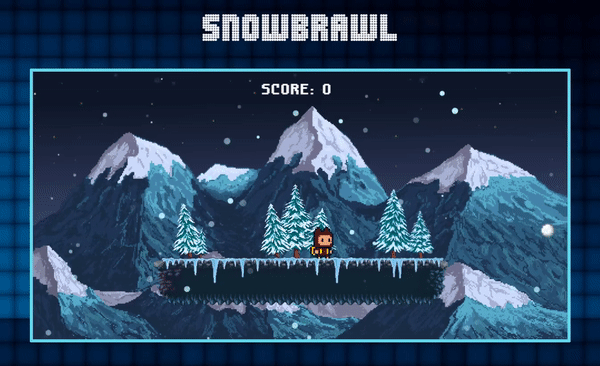

# SnowBrawl!

## Introduction



**SnowBrawl** is a fun and addicting original platform game. SnowBrawl was built using only vanilla JavaScript and HTML Canvas.

Check out the live site [here](https://dmechenko.github.io/aA-SnowBrawl/)

## Gameplay

SnowBrawl is a game that gets more and more intense the longer you play. Snowballs are flying in from either direction, control the Bearling to dodge the snowballs by jumping over and ducking under them. If you get hit, it's game over!

My personal high score is 20, try to beat it!

## Functionality

Players are able to:

- Close the instructions modal with the 'Enter' key.
- Move, jump, and duck using the 'W', 'S', 'D', and 'Space' keys.
- Keep track of their score.
- Restart the game with the 'Enter' key after losing.

## Technologies Used

- Vanilla JavaScript
- HTML 5
- CSS 3

## Features

### Canvas

The file structure used in SnowBrawl is very modular, objects and actions are organized into classes in order to separate concerns. Classes such as the player and snowballs are animated separately and manipulated within the main Game.js file, where the interactions are defined.

For instance, the way that the player moves is defined within the class, where boundaries and constraints are set in order to prevent bugs and exploits. Within the same function, I iterate over the character's spritesheet to animate them.

```js
 move() {
    this.char.moving = false;
    if (this.keys['a'] && this.char.x > 160) {
      if (this.char.frameCount < 10) {
        this.char.frameCount++;
      } else if (this.char.spriteSheetY >= 17) {
        this.char.spriteSheetY--;
        this.char.frameCount = 0;
      } else {
        this.char.spriteSheetY = 17;
        this.char.frameCount = 0;
      }

      this.char.x -= this.char.speed;
      this.char.moving = true;
    }
    if (this.keys['d'] && this.char.x < 690) {
      if (this.char.frameCount < 10) {
        this.char.frameCount++;
      } else if (this.char.spriteSheetY <= 10) {
        this.char.spriteSheetY++;
        this.char.frameCount = 0;
      } else {
        this.char.spriteSheetY = 10;
        this.char.frameCount = 0;
      }
      this.char.x += this.char.speed;
      this.char.moving = true;
    }

    if (this.keys[' '] && !this.char.jumping) {
      let jump = new Audio('./src/assets/jump2.wav');
      jump.volume = 0.2;
      jump.play();
      this.char.y -= this.char.jumpStrength;
      this.char.jumping = true;
      this.char.moving = true;
      delete this.keys[' '];
    }
    if (!this.keys[' '] && this.char.y < 245) {
      this.char.y += this.char.gravity;
      this.char.moving = true;
      this.char.jumping = true;
    }

    if (this.keys['s'] && this.char.spriteSheetY < 14) {
      this.char.spriteSheetY = 13;
      this.char.moving = true;
      this.char.y = 252;
    }
    if (this.keys['s'] && this.char.spriteSheetY > 13) {
      this.char.spriteSheetY = 14;
      this.char.moving = true;
      this.char.y = 252;
    }
  }

  idleAnimationLogic() {
    if (this.char.spriteSheetY < 14 && this.char.moving === false) {
      if (this.char.frameCount < 10) {
        this.char.frameCount++;
      } else if (this.char.spriteSheetY < 8) {
        this.char.spriteSheetY++;
        this.char.frameCount = 0;
      } else {
        this.char.spriteSheetY = 0;
        this.char.frameCount = 0;
      }
      this.char.y = 245;
    }
    if (this.char.spriteSheetY > 13 && this.char.moving === false) {
      if (this.char.frameCount < 10) {
        this.char.frameCount++;
      } else if (this.char.spriteSheetY < 27) {
        this.char.spriteSheetY++;
        this.char.frameCount = 0;
      } else {
        this.char.spriteSheetY = 19;
        this.char.frameCount = 0;
      }
      this.char.y = 245;
    }
  }
```

Within the game file, snowballs are created and added to an array. From there, each snowball object is manipulated and checked for either a collision, or when it leaves the canvas (either adding to the score, or setting the game to be over, respectively)

```js
 createSnowball() {
    if (this.spawnSnowball % 100 === 0) {
      this.difficulty++;
      this.snowballArray.push(
        new Snowball(this.ctx, this.difficulty + 0.1 * (Math.random() + 1))
      );
    }
    for (let i = 0; i < this.snowballArray.length; i++) {
      this.snowballArray[i].animate();
      if (this.utilities.detectCollision(this.player, this.snowballArray[i])) {
        this.gameOver = true;
      }
      if (
        this.snowballArray[i].ball.x > 960 &&
        this.snowballArray[i].initialX === 0
      ) {
        this.snowballArray.splice(i, 1);
        this.score++;
      } else if (
        this.snowballArray[i].ball.x < 0 &&
        this.snowballArray[i].initialX === 960
      ) {
        this.snowballArray.splice(i, 1);
        this.score++;
      }
    }
  }
```

To add some ambience, there's another canvas overlaying the actual game in order to emulate snowfall. An array of snowflakes is created, and each snowflake receives coordinates and velocity. Once they cross the lower boundary, their vertical coordinates reset to a random position to appear as a never-ending snowfall.

```js
function addToSnowflakes() {
  for (let i = 0; i < amountSnowflakes; i++) {
    snowFlakes.push({
      // add n snowflakes as objects with properties
      x: Math.random() * snowCanvas.width, //random x coordinate based on canvas width
      y: Math.random() * snowCanvas.height, //random y coordinate based on canvas height
      opacity: Math.random(), //random opacity between 0 and 1
      xVelocity: random(-10, 10), //random x velocity using previously defined function
      yVelocity: random(-10, 10), //random y velocity using previously defined function
      radius: random(1, 5), //random radius of snowflake
    });
  }
}
```

<!-- # Development ReadMe

## 1. Background & Overview

SnowBrawl will be a game that gets more intense the longer you can stay alive. Players will be dodging snowballs coming from either side of the screen. The two ways to dodge the snowballs are either ducking under them or jumping over them. This'll be handled using collision detection.

After every successfully dodged snowball, the difficulty will be increased slightly. This means that every subsequent snowball that is created and rendered will be traveling incrementally faster. They will also increase in size, but the size will cap after a certain point.

You'll start in the middle of a platform that is rendered in front of snowy mountains, and will have the ability to traverse the platform until it's end on either side.

## 2. Functionality

In SnowBrawl, players will be able to:

- Initiate a new game by pressing start.
- Toggle sounds/music.
- Move around and dodge incoming snowballs.
- Keep track of their 'lives' displayed using hearts.
- Lose hearts on hit. The game will end when you take a hit and have no remaining hearts.

The following will also be available:

- An instructional guide describing the mechanics and how to play.
- An up-to-date READme

## 3. Wireframes

The game will consist of a canvas on a single screen where the player will start. (Ideally, I'll there will be some nice moving snow particles as well.) There'll also be a counter for how many snowballs have been dodged.

I'll implement a clickable 'How to Play', a mute/unmute music and sound button, links to my GitHub and LinkedIn (potentially more later), as well as a restart button.


## 4. Architecture and Technology

Everything will be implemented with canvas, using assets I've either found online or created myself.
Javascript will be used for all the game logic, keeping everything modular - there will be game.js, environment.js, player.js, and gameview.js files.
CSS will be utilized for styling and layout of the page.

## 5. Implementation Timeline

Friday through the weekend 8-13 -- 8-15: Figuring out the modular layout, working on environment and background, and first stage player and snowball projectiles.

Monday 8-16: Making sure that all the game logic works as it should - player is able to move within bounds of the map, jump and duck are functional, and snowballs appear.

Tuesday 8-17: Game difficulty increase per projectile dodge implemented, projectiles work as expected, collision implementation skeleton defined.

Wednesday 8-18: Styling and layout polishing, making sure that everything works.

Thursday 8-19: Final touches and online launch!!

## 6. Bonus Features

Upon completion of V1.0 of SnowBrawl, the following will be added if time allows:

- Power-ups such as double jump, extra life, time slow.
- A separate snow lodge where your character can just relax and have a cup of tea! -->
